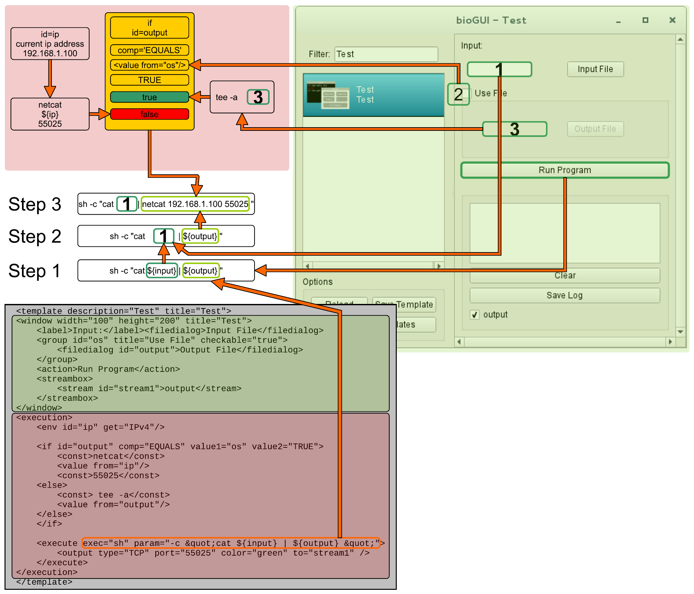

.. _bioGUI_working_mechanism :

*********************
How does bioGUI work?
*********************

*bioGUI* relies on the philosophy that the visual appearance as well as the assembly of the command line arguments can be represented as a network.
Especially templates are seen as network, both in their visual description but most importantly also in the execution model.

.. _biogui_install_modules :

Install modules
================

*bioGUI* install modules are designed to make the regular user's life as easy as possible.
Originally created for WSL, so pure Windows users can also easily install their needed software without the need to care about dependencies, the idea of the *bioGUI* repository evolved.
Install modules are more than just templates, because they install the actual software onto the user's system, while customizing the *bioGUI* template for this application.
All install modules are regular shell scripts, that are called with fixed parameters.

In general, *install modules* can be divided into two parts:

#. installing the software and its dependencies
#. submitting the *bioGUI* template

For the first part, first the command line arguments are collected and saved.
The order of the command line arguments is specified as

#. installation directory (PROGDIR)
#. **sudo** password (if not supplied, installing dependencies is allowed to fail)
#. [0, 1] for adding software binary to $PATH.
#. IP to send template to
#. PORT to send template to

A typical template is then structured as follows:

.. code:: bash

    #! Install hisat2-2.0.5

The text after the shebang is shown as title in the *Install template Module*.

.. code:: bash

    if [ ! "$2" = "" ]; then

        if [ "$(uname)" == "Darwin" ]; then

            echo "Installing brew gcc"
            brew install gcc

        else

            echo "No dependencies"
            echo $2 | sudo -S apt-get update
            echo $2 | sudo -S apt-get install build-essential
        fi

    else
        echo "No sudo password, not installing dependencies"
    fi

If a **sudo** password is supplied, dependencies are installed. This must be compatible with Ubuntu's aptitude, as this is what WSL runs on.
Using the `uname` switch, *bioGUI* also supports Mac OS and *brew*, for instance.

Since a lot of harm can be done using the super-user account, install modules are manually curated after submission.

.. code:: bash

    ## set all variables
    PROG=hisat2-2.0.5

    PROGDIR=$1
    if [ -z "${PROGDIR}" ]; then
        PROGDIR=~/bioGUI/progs/
    fi

    PROGDIRESC=$(echo $PROGDIR | sed 's/ /\\ /g')

    ## create progdir
    mkdir -p "$PROGDIR"

Next some variables need to be set up. It showed of great benefit to create a $PROG variable containing the application and version.
The $PROGDIR variable contains the installation path, which is also checked to exist.
For several reasons it is also a good idea to have an escaped version of the install path by hand.

.. code:: bash

    #download and unzip
    if [ ! -f "$PROGDIR/$PROG.zip" ]; then
        wget ftp://ftp.ccb.jhu.edu/pub/infphilo/hisat2/downloads/hisat2-2.0.5-source.zip -O "$PROGDIR/$PROG.zip"
    fi

    if [ ! -d "$PROGDIR/$PROG" ]; then
        cd "$PROGDIR"
        unzip $PROG.zip -d "$PROGDIR/"
    fi

Before actually installing the program, make sure to download and unzip/untar the application source code.
For reasons of parsimony, this is only done when the expected file or folder does not exist.

.. code:: bash

    #install prog
    cd "$PROGDIR/$PROG"

    make

    if [ $# -gt 2 ]; then

        if [ "$3" = "1" ]; then

            if ! grep -q "$PROGDIRESC/$PROG" ~/.bashrc; then
                echo "export PATH=\"$PROGDIRESC/$PROG:\$PATH\" " >> ~/.bashrc;
            fi
        fi

    fi

After downloading and unzipping, the application can be built in the target directory.
Finally, if wanted, the path to the application's executable is added to the $PATH variable.

Certain programs may need some fixes to work properly on Mac OS, Linux or WSL.
This is the place where such fixes could go.

Finally we can send the template to *bioGUI*, if an IP address and port have been specified:

.. code:: bash

    if [ $# -eq 5 ]; then

    IP=$4
    PORT=$5

    NCCMD=""

    if [ "$(uname)" == "Darwin" ]; then
        NCCMD="nc -c $IP $PORT"
    else
        NCCMD="nc -q 0 $IP $PORT"
    fi

    $NCCMD <<EOF

    <template description="hisat2 2.0.5 aligner" title="hisat2 2.0.5">
        ...
        <const id="bindir">${PROGDIR}/${PROG}/</const>
        ...
        <execute program="hisat2" param="\${cl}" location="\${bindir}" exec="hisat2" wsl="WSLsel">
            <output type="COUT" color="green" to="outputstream1" />
            <output type="CERR" color="red" to="outputstream2" />
        </execute>

    </template>
    EOF

    fi

Make sure to use ``nc`` to send the content back to *bioGUI*.
Unfortunately the nc-programs differ on Mac OS and Ubuntu, hence the command must be altered according to the underlying OS.

In order to customize the template inbetween the ``EOF``, bash variables to be replaced must be written as ``${var-name}``.
This conflicts with how *bioGUI* expects variables. Therefore, make sure to escape the backslaash where you want to access variables in the *bioGUI* template!

bioGUI Templates
================

*bioGUI* templates consist of two parts: the ``<window>``-part which defines the visual appearance and the ``<execute>``-part which defines how the command line arguments of an application are assembled from the graphical input elements.

.. _biogui_visual_model:

Visual Model of Templates
=========================

Layouts
-------

There exist three different layouts in *bioGUI*:

#. horizontal
#. vertical
#. grid

Layouts may have either visual components as child, or further layouts.
However a visual component may only have one layout child and this must be the first child.

For instance, the *cols* attribute for the *grid* layout tells how many columns are needed.
If only one attribute is specified, the other attribute is calculated from the number of children and the given attribute.

Layout Components
^^^^^^^^^^^^^^^^^

+--------------+-----------------------+
| **node name**| **allowed attributes**|
+--------------+-----------------------+
|<GRID>        |           [cols, rows]|
+--------------+-----------------------+
|<HGROUP>      |                     []|
+--------------+-----------------------+
|<VGROUP>      |                     []|
+--------------+-----------------------+

Visual Elements
---------------

In contrast to layout components, visual elements are direct input elements.

Graphical Components
^^^^^^^^^^^^^^^^^^^^

+-------------------+--------------------------------------------------------------+
| **node name**     | **allowed attributes**                                       |
+-------------------+--------------------------------------------------------------+
|<ACTION>           |[program]                                                     |
+-------------------+--------------------------------------------------------------+
|<CHECKBOX>         |                            [selected, selectonwindows, value]|
+-------------------+--------------------------------------------------------------+
|<COMBOBOX>         |                                                    [selected]|
+-------------------+--------------------------------------------------------------+
|<COMBOITEM>        |                                                       [value]|
+-------------------+--------------------------------------------------------------+
|<FILEDIALOG>       |[filter, folder, location, multiples, multiples_delim, output]|
+-------------------+--------------------------------------------------------------+
|<FILELIST>         |                                        [height, title, width]|
+-------------------+--------------------------------------------------------------+
|<FILESELECTBOX>    |                                     [delim, filter, location]|
+-------------------+--------------------------------------------------------------+
|<GROUP>            |                                        [height, title, width]|
+-------------------+--------------------------------------------------------------+
|<GROUPBOX>         |                                                       [multi]|
+-------------------+--------------------------------------------------------------+
|<IMAGE>            |                                          [height, src, width]|
+-------------------+--------------------------------------------------------------+
|<INPUT>            |                  [multi, type {string, int, float, password}]|
+-------------------+--------------------------------------------------------------+
|<LABEL>            |                                                        [link]|
+-------------------+--------------------------------------------------------------+
|<RADIOBUTTON>      |                                                       [value]|
+-------------------+--------------------------------------------------------------+
|<SLIDER>           |                                              [max, min, step]|
+-------------------+--------------------------------------------------------------+
|<SLIDERITEM>       |                                              [display, value]|
+-------------------+--------------------------------------------------------------+
|<STREAM>           |                                        [height, title, width]|
+-------------------+--------------------------------------------------------------+
|<STREAMBOX>        |                                                              |
+-------------------+--------------------------------------------------------------+
|<WINDOW>           |                                       [height, title, width] |
+-------------------+--------------------------------------------------------------+

.. _biogui_execution_model:

Execution Model of Templates
============================

Execution Network
-----------------

Within a *bioGUI* template, the ``<execution>...</execution>`` part defines how the command line argument to be executed is assembled.
The idea is again based on a network of predefined nodes.
The nodes can either be visual components, accessed by their respective **id**, or :ref:`biogui_execution_nodes` .

Upon starting an application with *bioGUI*, the execution network is responsible to construct the command line arguments with which the target application is called.
Therefore, all executable nodes in the ``<execution>`` part are searched and *evaluated* one after the other (if there exist several).
Since execution must be started via an ``action`` visual element, which can have a *program* attribute, this allows to specify which executable nodes are executed: if the ``program`` attribute is set, this must match with the ``program`` attribute of the executable node.

Finally an executable node is executed. Upon this the command line arguments are assembled. This is shown exemplarily in the below figure:

    Illustration of an *Execution Network* for a simple example application.
    The command line arguments for the executable ``sh`` are collected from the nodes with ``id`` s *input* and *output*.
    While *input* refers to a visual component node, the *output* id refers to an ``if`` node, which collects data from another visual component node (**3**) or a node which constructs a *netcat* command, depending on whether the visual node with id *os* (**2**) equals ``TRUE`` or not.

List of available execution nodes:

.. _biogui_execution_nodes:

Execution Nodes
^^^^^^^^^^^^^^^

+--------------------------+---------------------------------------------------------------------+
| **node name**            | **allowed attributes**                                              |
+--------------------------+---------------------------------------------------------------------+
|<add>                     |                                                      [ID, TYPE, sep]|
+--------------------------+---------------------------------------------------------------------+
|<const>                   |                                                           [ID, TYPE]|
+--------------------------+---------------------------------------------------------------------+
|<else>                    |                                                                   []|
+--------------------------+---------------------------------------------------------------------+
|<env>                     |                                                      [GET, ID, TYPE]|
+--------------------------+---------------------------------------------------------------------+
|<execute>                 |             [EXEC, ID, PROGRAM, TYPE, location, param, program, wsl]|
+--------------------------+---------------------------------------------------------------------+
|<update>                  |                                    [deferred, target, attrib, value]|
+--------------------------+---------------------------------------------------------------------+
|<messagebox>              |                                                           [deferred]|
+--------------------------+---------------------------------------------------------------------+
|<file>                    |                                            [FROM, ID, SEP, TO, TYPE]|
+--------------------------+---------------------------------------------------------------------+
|<httpexecute>             |                         [CL_TO_POST, DELIM, ID, PORT, PROGRAM, TYPE]|
+--------------------------+---------------------------------------------------------------------+
|<if>                      |                                [COMP, ID, SEP, TYPE, VALUE1, VALUE2]|
+--------------------------+---------------------------------------------------------------------+
|<math>                    |                                                       [ID, OP, TYPE]|
+--------------------------+---------------------------------------------------------------------+
|<orderedadd>              |                                           [FROM, ID, SELECTED, TYPE]|
+--------------------------+---------------------------------------------------------------------+
|<output>                  |    [COLOR, DEFERRED, FROM, HOST, ID, LOCATION, PORT, TO, TYPE, TYPE]|
+--------------------------+---------------------------------------------------------------------+
|<relocate>                |                             [FROM, ID, PREPEND, TO, TYPE, UNIX, WSL]|
+--------------------------+---------------------------------------------------------------------+
|<replace>                 |                                    [ID, REPLACE, REPLACE_WITH, TYPE]|
+--------------------------+---------------------------------------------------------------------+
|<script>                  |                                             [ARGV, ID, SCRIPT, TYPE]|
+--------------------------+---------------------------------------------------------------------+
|<value>                   |                                                [FOR, FROM, ID, TYPE]|
+--------------------------+---------------------------------------------------------------------+
