.. _build_wsl_intro:

How to setup WSL (Bash on Ubuntu)
=================================

Depending on your Windows version you need to activate Developer Mode first.
How this is done is explained at the end of this page.

For all recent versions of Windows 10 you can start with step 1.

Step 1: Activate WSL feature
-----------------------------

First WSL has to be enabled from Windows features.
Therefore, simply search for the *Turn Windows features on or off* option in the control panel.

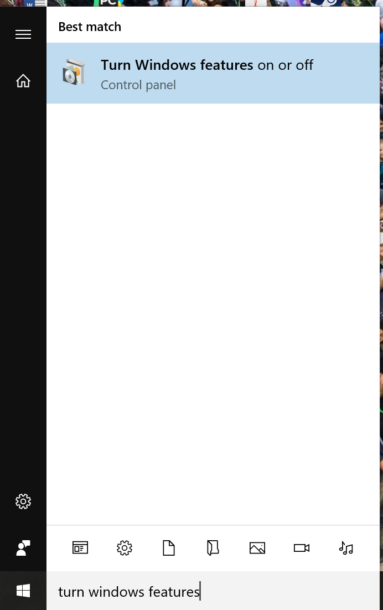

Once found, look for the *Windows Subsystem for Linux (Beta)* row and make sure to check the corresponding box.

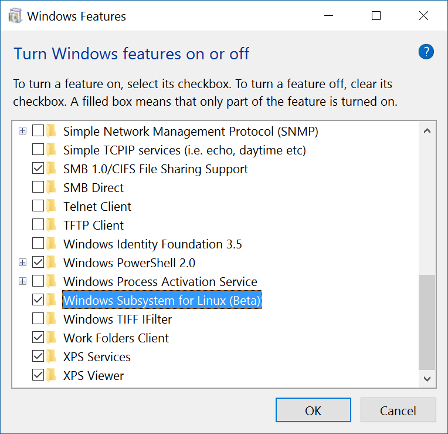

This will download and install the desired WSL feature.
Finally apply the change and make sure to reboot your computer

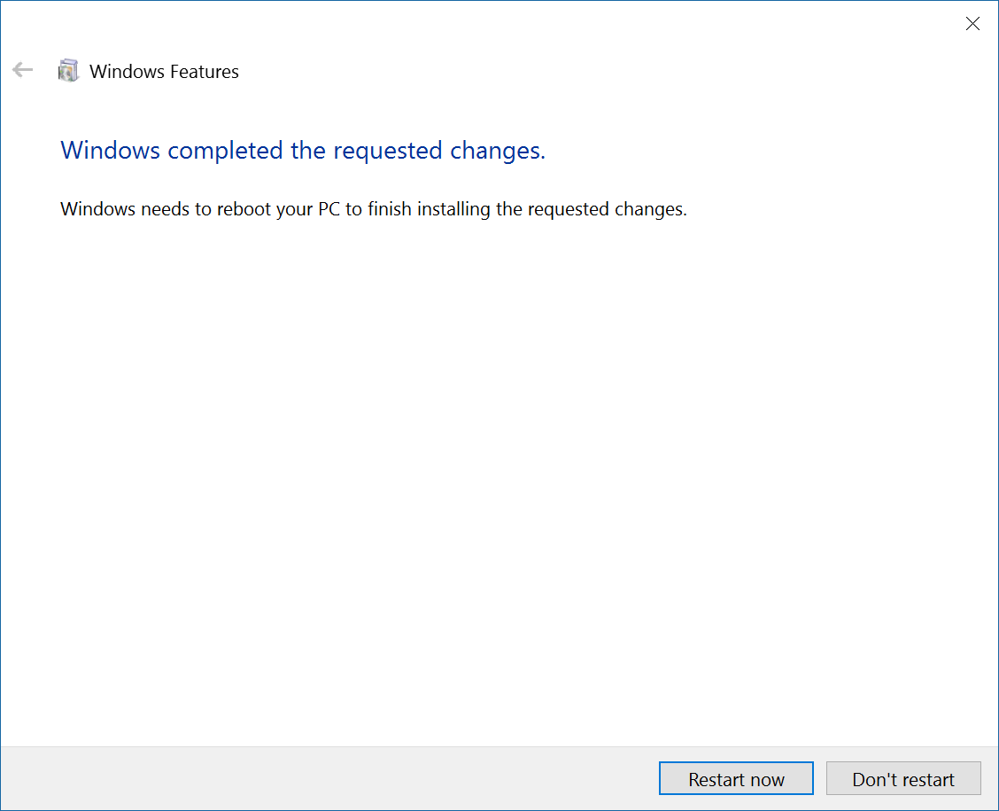

Step 2: Install Linux
---------------------

After having enabled the WSL feature, we can visit the Microsoft Windows Store to download Linux.

In order to do so, we open the Windows Store app, and search for *Linux*. We select the *Run Linux on Windows* menu entry.

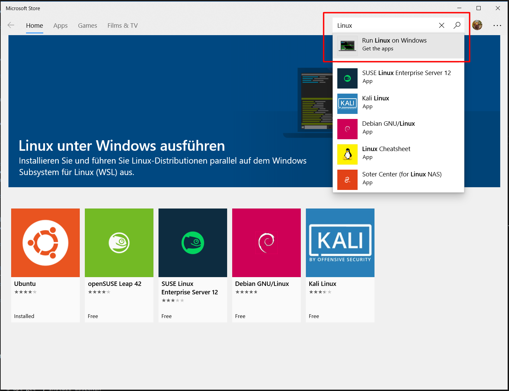

There are many different flavors (comparable to strains in biology) of linux and some are already offered on the Windows store.
Best compatibility for *bioGUI* has Ubuntu.

*Important*: You should consider using the latest Ubuntu version available. This is Ubuntu 18.04 at the time of writing. You specifically have to search for *Ubuntu 18.04* in the store !

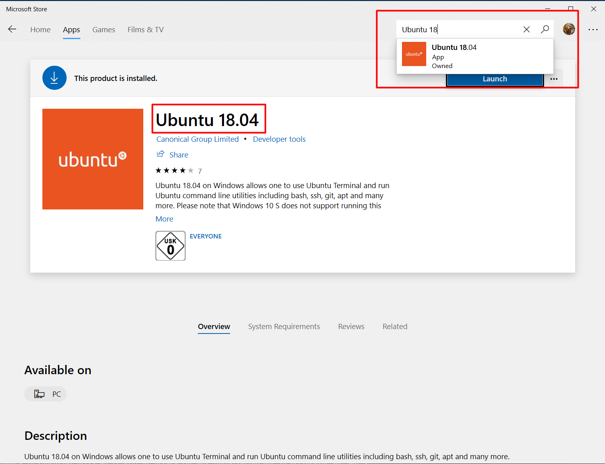

Now let the Windows store install your Linux app and once that is done, open your newly installed Linux:

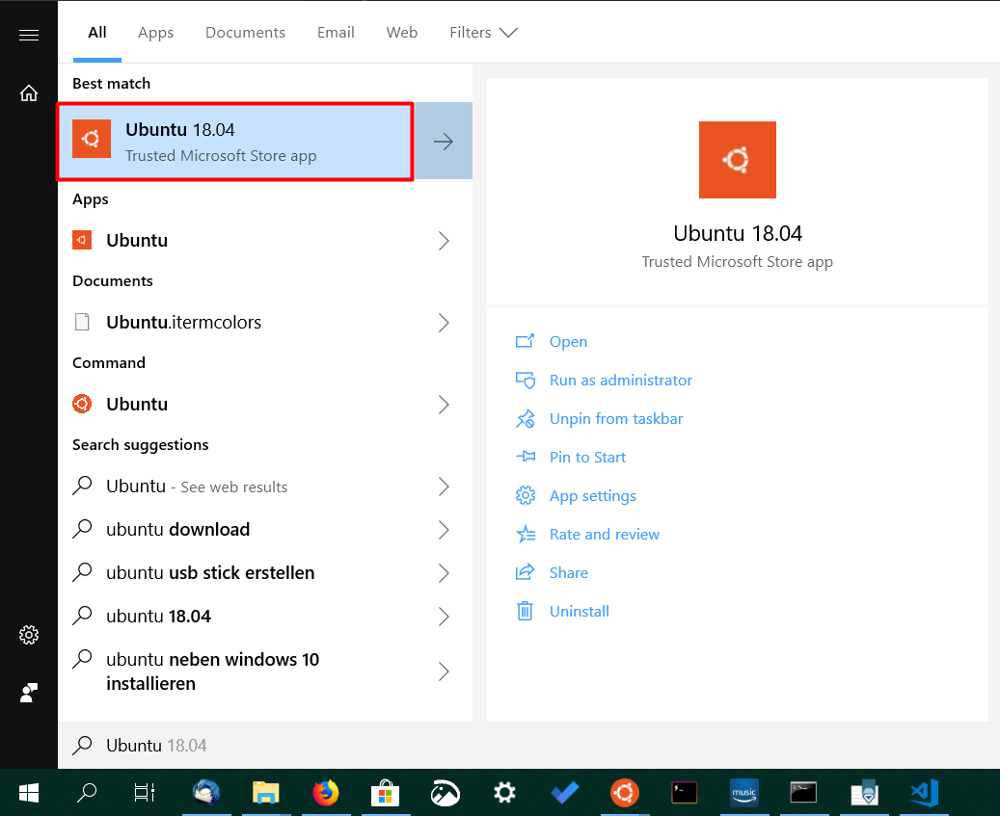

The black screen will guide you through the install process.
It will first unpack itself and then ask you to create a linux user account.

It is recommended to choose a username and password you can easily remember.
Remembering the password is essential here, as it will be needed for any installation to be performed on *WSL* and by *bioGUI*.

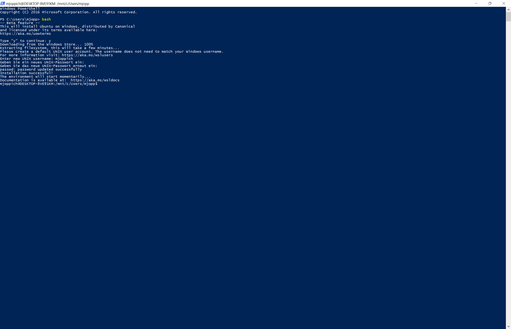

Step 3: Prepare WSL
-------------------

Before you can use *bioGUI* on *WSL*/Ubuntu please make sure to run the *First time Ubuntu/WSL/apt-get Setup* from *bioGUI*.
For the *sudo/user password* please enter the password for your linux user account from the step above.

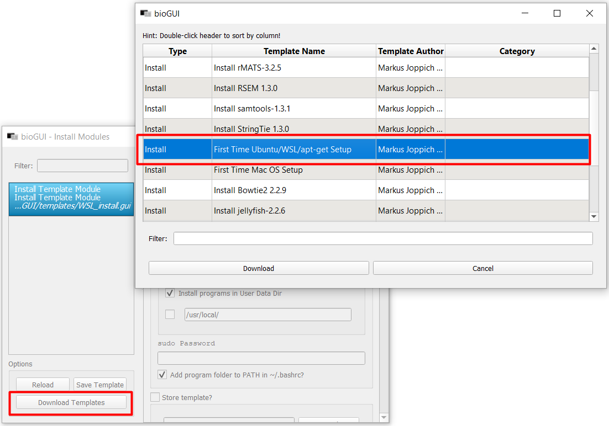

In case there are problems please contact the author of the software.

If you are running an old Windows 10 version, you first need to activate developer mode before you are able to enable the Windows Subsystem for Linux feature.

Step 0: Activate Developer Mode

Since WSL/Bash on Ubuntu on Windows is a developer feature, first the developer mode has to be actived.
Therefore we go into the Settings app and select *Update & Security*.

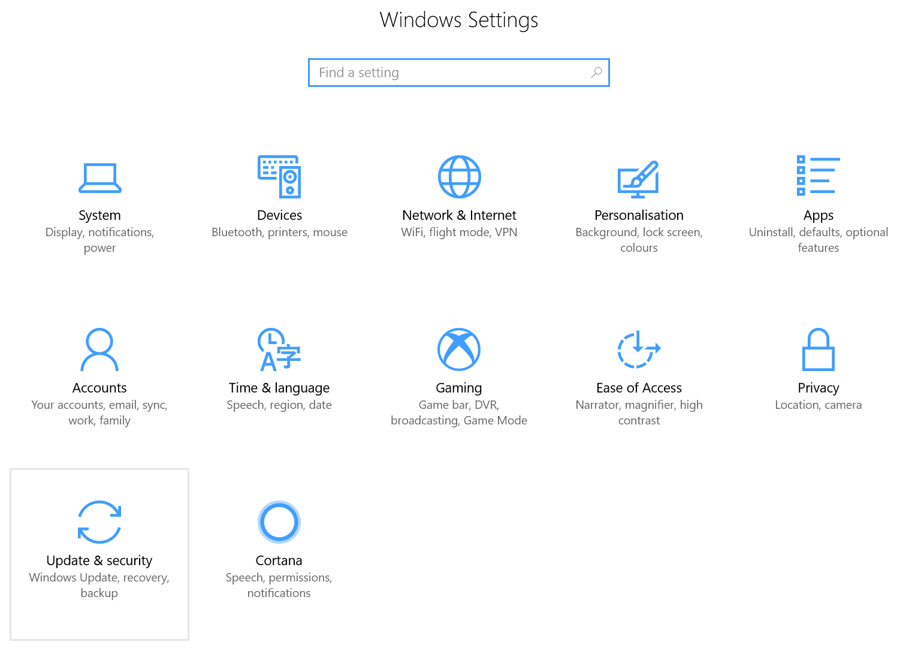

We further navigate into the *For developers* tab on the left.

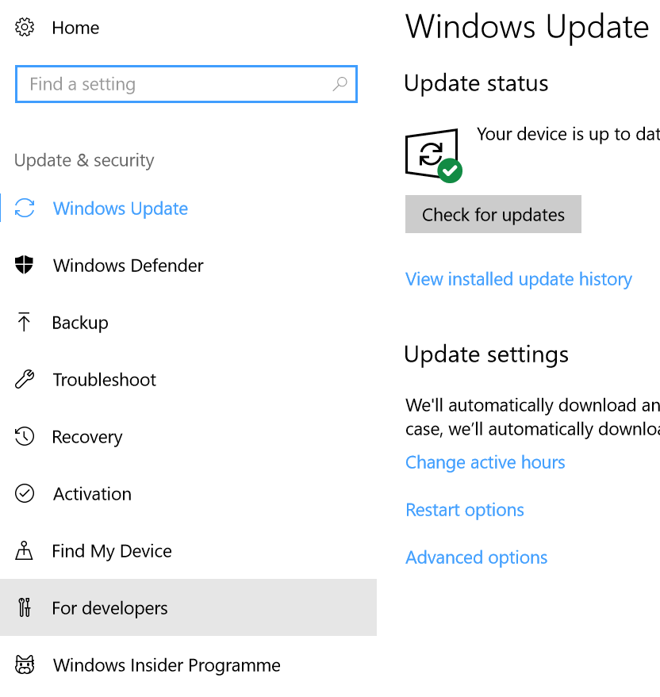

In the *For developers* options we switch from *Windows Store apps* to *Developer mode*.

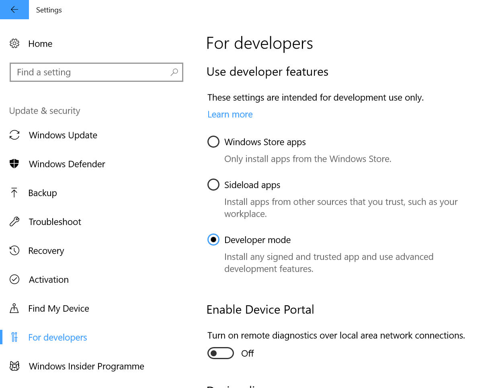