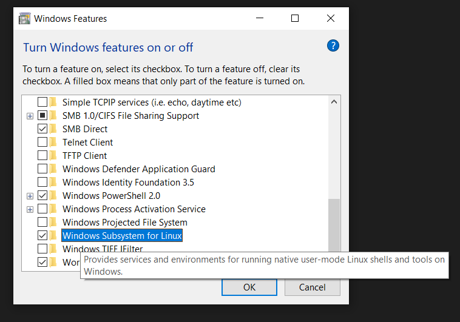

.. _build_wsl_intro:

How to setup WSL (Bash on Ubuntu)
=================================

Step 1: Activate Developer Mode

Since WSL/Bash on Ubuntu on Windows is a developer feature, first the developer mode has to be actived.
Therefore we go into the Settings app and select *Update & Security*.

.. image:: ./images/wsl/dev_mode_1.PNG
   :scale: 30

We further navigate into the *For developers* tab on the left.

.. image:: ./images/wsl/dev_mode_2.PNG
   :scale: 30

In the *For developers* options we switch from *Windows Store apps* to *Developer mode*.

Step 2: Activate WSL feature
-----------------------------

First WSL has to be enabled from Windows features.
Therefore, simply search for the *Turn Windows features on or off* option in the control panel.

.. image:: ./images/wsl/turn_feature_on.PNG
   :scale: 30

Once found, look for the *Windows Subsystem for Linux (Beta)* row and make sure to check the corresponding box.

This will download and install the desired \acf{WSL} feature.
Finally apply the change and make sure to reboot your computer

.. image:: ./images/wsl/restart_after_sel.PNG
   :scale: 30

Step 3: Setup WSL
-----------------

Despite the interest to hide any command line as much as possible from the user, the following initial setup can not be automised.
First a Command Prompt or better PowerShell must be started.
Search for the *Windows PowerShell* in the start menu.

Next we type ``bash`` into the command line and Windows will download *WSL*.
However, before the download starts, first the user has to acknowledge that he wants to download *Bash on Ubuntu on Windows* by typing in ``y`` and confirming with ``<enter>``.

Finally, after *WSL* has been downloaded and extracted, *WSL* has to create a linux user account.
It is recommended to choose a username and password you can easily remember.
Remembering the password is essential here, as it will be needed for any installation one is performing on *WSL*.

.. image:: ./images/wsl/powershell_setup_user.PNG
   :scale: 30

After having *WSL* installed, it has to be setup once to install commonly used dependencies.

.. code::

    #! First Time WSL Setup

    echo $2 | sudo -S apt-get update
    echo $2 | sudo -S apt-get -y install build-essential
    echo $2 | sudo -S apt-get -y install dos2UNIX

The above commands must be executed once for this purpose.
For ease of use, *bioGUI* provides an *Install Template Module* template as well as a first time *WSL* setup install template.
After downloading both and executing the first time *WSL* setup *WSL* is set up to be used with *bioGUI*.

The first time *WSL* setup essentially first updates the *Ubuntu* packet manager and then installs most common compilation libraries as well as a tool to convert Windows line endings into UNIX ones.
Using the *Install Template Module* one has to enter the password of the newly created user account.

