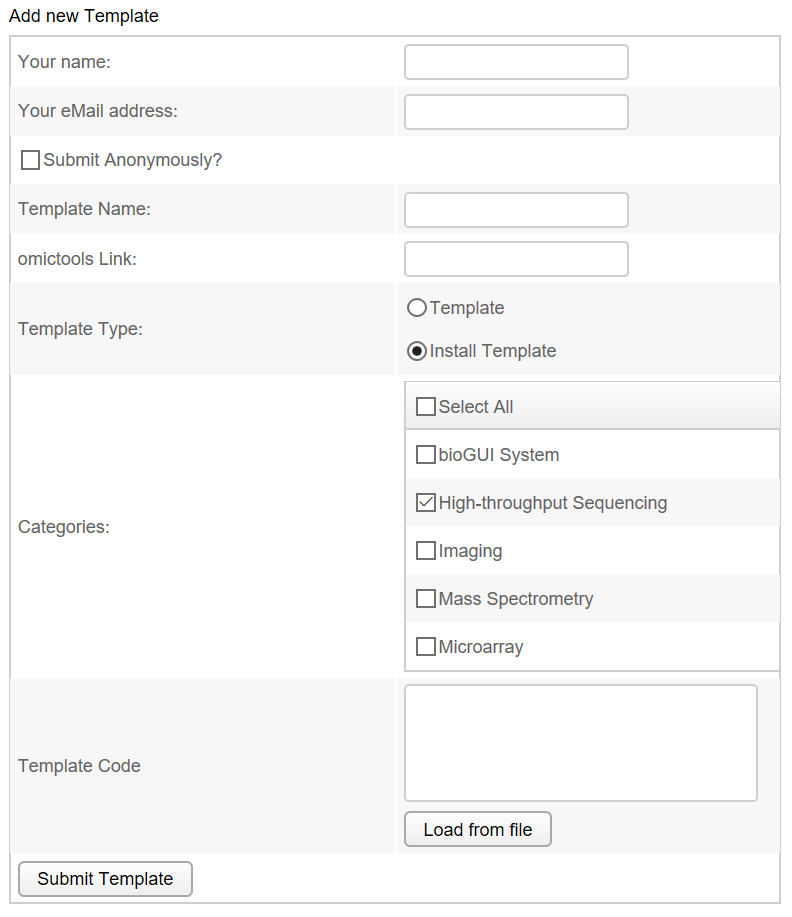
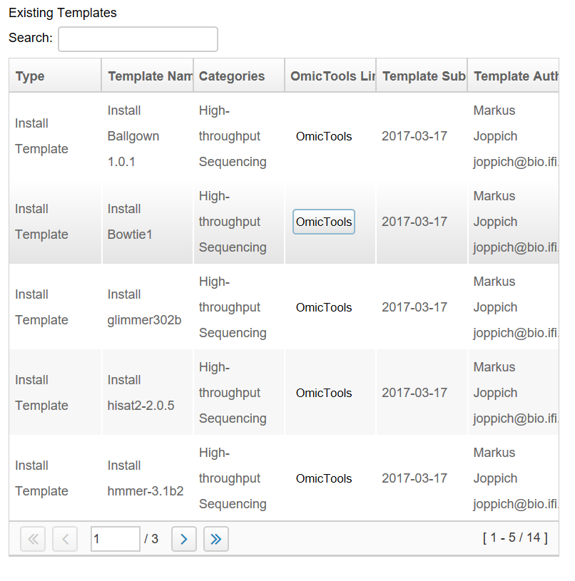

.. _user_guide:

********************
User Guide
********************

How to get bioGUI?
==================

Download bioGUI releases from the `github releases <http://github.com/mjoppich/bioGUI/>`_.
Please note additional information provided in our :ref:`user_guide`.

.. _download_templates:

Install bioGUI
==============

Binary packages/releases for the following operating system are provided on github.

Windows
-------

Extract the zip-File and place the contained bioGUI folder somewhere on your hard drives.

**Please do not put bioGUI in your Program Files directory, as this is specially protected by Windows and may cause problems.**

**Place bioGUI into a location which does not contain spaces in its name, e.g not `C:\Program Files\bioGUI` ! `C:\bioGUI` or `D:\bioGUI\` is fine though!**

Linux
-----

Extract the `tar.gz` file and place the contained bioGUI folder somewhere on your hard drives.

Mac OS
------

Download and open the provided dmg package. You can simply drag and drop the bioGUI.app into your Applications folder.
In order to productively use bioGUI, it may be required to install the OSX command line tools as well as brew.
Most (install) templates will require you to have wget and netcat installed. Using brew installation is simple:

.. code:: bash
    
    brew install wget netcat

You can get brew from `here <http://brew.sh/>`_

.. _install_download_templates:

Installing new software with Install Modules
============================================

After downloading an *Install Module*, the *Install Template Module* will list the downloaded install template (you might need to *reload* once).
The screenshot below shows the *Install Template Module*.
In the dropdown menu, the *hisat2* install template has been chosen.
Since this module is executed on Windows, *WSL* is selected.
*hisat2* is supposed to be installed into the *User Data Dir*, which is on *WSL* and linux usually ``~/.local/share/bioGUI``.
This is the directory where *bioGUI* installs new programs.
Advanced users may want to change this settings, but in general, it should be left.

In order to automatically install dependencies, the sudo-password must be supplied.
This is the password you set up during the installation of the *WSL* feature.
This gives *bioGUI* administrative rights within *WSL* such that it can install dependencies automatically.

Finally the path for the specific *GUI* template has to be set. *bioGUI* by default only searches the template directory besides the executable.
*GUI* templates must have the file extension ``.gui``. If your entered template name does not end with this extension, the extension is appended to your filename.
As a short-cut, if you just enter a name (e.g. mygui), *bioGUI* will save the new template in the template directoy with the filename `mygui.gui`.

Use-case: Windows setup
=======================
The binary distribution (zip-files) are targeted for *end-users*: [prebuilt binaries](https://github.com/mjoppich/bioGUI/releases).
Download the Windows version.

Make sure that the Windows Subsystem for Linux (WSL) is installed.
Please follow the steps on [how to setup WSL](http://biogui.readthedocs.io/en/latest/build_wsl.html).

After downloading the zip-archive, please unzip the archive to a location of your preference. Then simply start the executable (bioGUI.exe on Windows).
*Place bioGUI into a location which does not contain spaces in its name, e.g not C:\Program Files\bioGUI !*  C:\bioGUI is fine though!

On any aptitude supported platform (e.g. Windows with WSL, Ubuntu), please download the "First Time Ubuntu/WSL/apt-get Setup" from the list of available templates and install it via *Install Template Module* (install program: *First Time Ubuntu/WSL/apt-get setup*).

Below this process is shown by an animation.

Setup First Time Use
--------------------

For the *First Time Use* setups, please make sure to insert your *sudo/user* password and deselect to save a template.

Please make sure that bioGUI closes the setup with the following message:

If you do not see this message, (`raise an issue on GitHub <https://github.com/mjoppich/bioGUI/issues/>`_) with attaching the *log.txt* file in the bioGUI folder, or */tmp/log_biogui.txt* on Mac OS, as well as an screenshot of the attempt.

Install an install module
-------------------------

.. image:: ./images/bioGUI_graphmap.gif
   :scale: 50

After the install module has been installed, you will see a message stating that *bioGUI* installed the software:

If you do not see the message, but only blue text, like below, you need to scroll up:

If you do not see this message, (`raise an issue on GitHub <https://github.com/mjoppich/bioGUI/issues/>`_) with attaching the *log.txt* file in the bioGUI folder, or */tmp/log_biogui.txt* on Mac OS, as well as an screenshot of the attempt.

Use an Install Module
---------------------

After installing a software, e.g. graphmap, you can reload the list of available templates by pressing the reload button.

Download the install module for graphmap as shown in the previous section.
Next select the *graphmap* install module in the *Install Templates* template and fill out your *Linux User Password/sudo Password*. If you are on Windows, make sure that the *Use WSL?* checkbox is selected.

.. image:: ./images/template_usage/graphmap_1.png
    :scale: 50

Enter the name of the template you would like to use in the input field within the *Store Template* group box (which you should have selected). In order for bioGUI to find a template it must reside in the *template* folder next to the bioGUI executable.
Finally press *Install Program* and wait until the installation finishes.
Besides the template being sent to bioGUI (in blue text), you should see the green message that your program has been installed correctly:

You can now *Reload* the templates again and will see a *graphmap* template on the left:

In this template you have to possibility to select the alignment mode (align or overlap/owler), specify the reference sequence, reads, gene annotation file (for splice-aware alignment) as well as the output file.
To select files via a file dialog, click the corresponding button on the right.
Using the *Additional Options* field, you can also enter command-line parameters directly.
This may be necessary because the template is not complete, or new options have been added (or because you know shortcuts).

Exemplarily we filled our some parameters:

.. image:: ./images/template_usage/graphmap_4.png
    :scale: 100

Clicking on *Run Graphmap* will now execute graphmap via bioGUI. In this case, the called command-line tool is ``graphmap -r <reference> -d <reads> -o <output>``.

Upon completion, the bioGUI options button (lower left) will become enabled again, as well as the *Run Graphmap* button. If you need to cancel the current process, click the *Cancel Run Graphmap* button.
You will see all the intermediate output from graphmap and have the option to save the command-line output using the *Save log* button.
If you want to save the inputs you made, using the *Save template* button of the bioGUI options, you can save the inputs you made. Save the template in the *template* directory in the same folder as bioGUI to see the template.

Adding Own Templates
=====================

Part of *bioGUI* is a simple accessibility of templates for various programs.
Therefore, application developers and sophisticated users can upload their templates to our website in order to make their template available to other users.
The user has to submit his name, eMail address, a template name and the template itself.
He can select whether he wants to be an anonymous user (user name is always hidden) and whether this is an installation script (which downloads and creates the \ac{GUI} template specifically for this installed application) or a regular template.
Additionally, categories for the template can be supplied, e.g. whether this is a template for a sequencing tool, or proteomics.
A screenshot of the template submission is shown below.

Additionally the (`bioGUI website <https://www.bio.ifi.lmu.de/software/biogui>`_) also contains a searchable list of already available templates.
Available templates are only shown and can be downloaded via the *bioGUI* application.

Within *bioGUI*, clicking the *Download Templates* button, a new dialog window opens showing a list of available templates.
Columns can be sorted by double clicking the header, and using the search only templates which contain the searched words are shown.
Upon selecting one or multiple (keep ctrl-key down while clicking) rows and clicking the *Download* button, those templates are downloaded and available for the user.
Since it is possible to copy or alter templates, *bioGUI* never overwrites existing templates, but will create a new copy.

